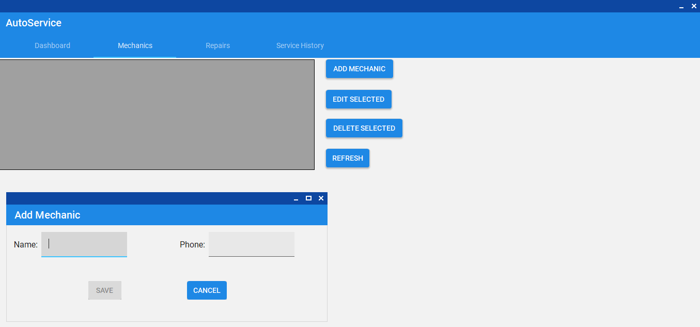

# AutoServiceGarage

A Windows desktop application to manage an auto‐service garage: track cars, mechanics, repairs and service history; export records to PDF/Excel; and visualize revenue with interactive charts.

---

## 🚗 Project Overview

**AutoServiceGarage** is a WinForms application built on .NET 8 and Entity Framework Core that enables auto‐service shops to:

- 📋 **Manage Mechanics & Cars**  
- 🔧 **Log Repairs** (date, description, cost, assigned mechanic & car)  
- 📜 **View & Search Service History** by license plate or VIN  
- 🖨️ **Export** single records or entire histories to **PDF** (QuestPDF) and **Excel** (ClosedXML)  
- 📊 **Dashboard**: total revenue & “Revenue by Mechanic” chart with date filtering (LiveChartsCore)  
- ✔️ **Input Validation** via DataAnnotations + ErrorProvider  
- 🎨 **MaterialSkin UI** for a modern look & feel  
- 🔒 **Fixed window size**, custom icon

---

## 🛠️ Tech Stack

- **.NET 8** / C# / WinForms  
- **Entity Framework Core** (SQL Server LocalDB)  
- **MaterialSkin** (UI theme)  
- **QuestPDF** (PDF export)  
- **ClosedXML** (Excel export)  
- **LiveChartsCore** (dashboard charts)  
- **DataAnnotations** + **ErrorProvider** (validation)  

---

## 📸 Screenshots

### 📊 Dashboard

Shows the total revenue header, a “Revenue by Mechanic” column chart (LiveChartsCore) with date‐range pickers on the right, and Apply/Reset buttons.

### 👨‍🔧 Mechanics

The Mechanics tab lists all mechanics in a DataGridView (ID, Name, Phone) with Add, Edit, Delete and Refresh buttons on the right.

#### - Add/Edit Mechanic

A dialog for creating or editing a mechanic.  
- **Name** field with inline validation (error icon if left blank).  
- **Save** button remains disabled until the name is valid.  
- **Cancel** to close without saving.

### 🔧 Repairs

Under Repairs, select a car from the autocomplete ComboBox, then view its service records (date, description, cost, mechanic) in the grid. Buttons allow adding a new repair, deleting, refreshing, or exporting the selected record to PDF.

#### - Add Repair

Form for logging a new service record:  
- **Date** picker with validation.  
- **Description** textbox (max 200 chars) with error provider.  
- **Cost** numeric up/down (must be > 0).  
- **Mechanic** dropdown to choose from existing staff.  
- **Select Existing Car** or **New Car** radio buttons, showing either an autocomplete combo or new-car fields.  
- **Save** button only enabled when all inputs are valid; **Cancel** to discard.

### 📜 Service History

Search by license plate or VIN to load a car’s complete repair history into the grid, then export that history to PDF or Excel. Input is validated and errors shown via standard MessageBoxes.

